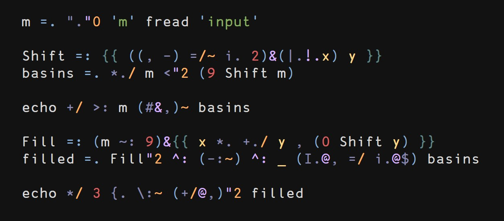

VIM-J
=====

Vim files for the J programming language

Currently just a better syntax file but I might add more later

FEATURES
========

Highlight groups for

  * Types of speech (verb, adverb, conjunction)
  * Special args in functions (x, y, m, n, u, v)
  * Rank numbers (different from numericsz)
  * and more...

EXAMPLE
=======

Example screenshot using the [jellybeans](https://github.com/nanotech/jellybeans.vim) colorscheme.

