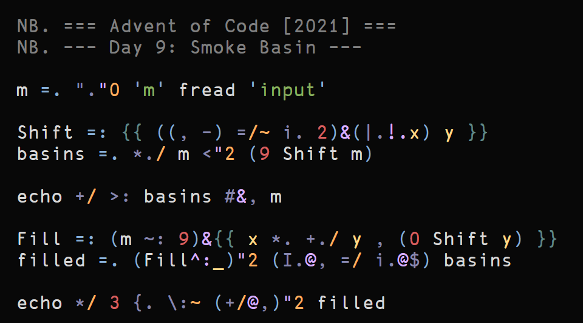
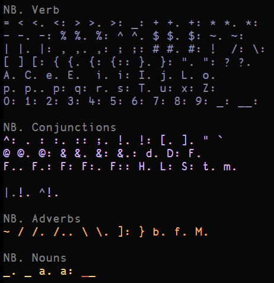
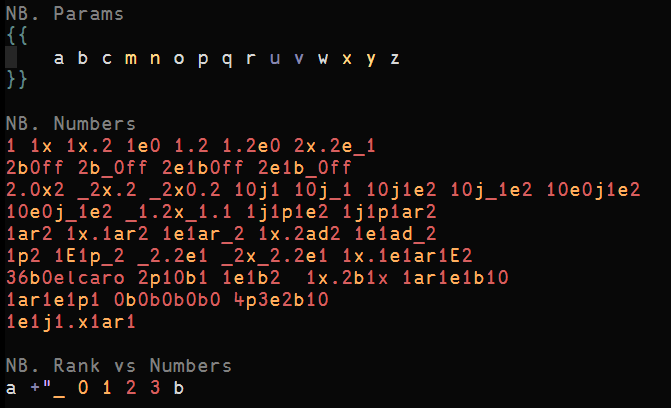
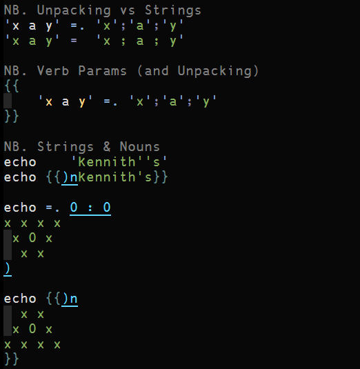
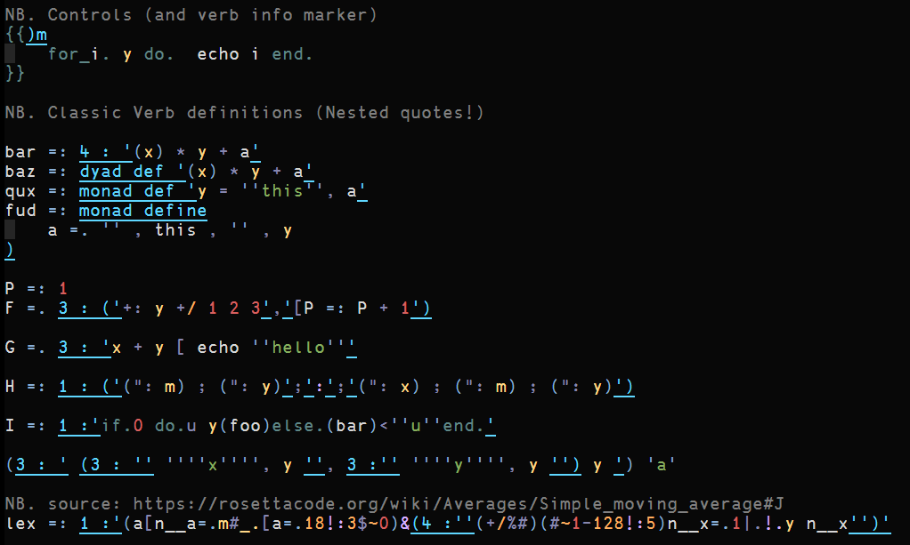

VIM-J
=====

Vim files for the J programming language

Currently just a better syntax file but I might add more later

FEATURES
========

Highlight groups for

  * Types of speech (verb, adverb, conjunction)
  * Special args in functions (x, y, m, n, u, v)
  * Rank numbers (different from numerics)
  * Unpacking assignment ('a b' =. y) (not highlighted as a string)
  * and more...

RELATED
=======

See also

  * My [J language plugin for highlight.js](https://github.com/0racle/highlightjs-j/tree/master)

SCREENSHOTS
===========

Example screenshots using the [jellybeans](https://github.com/nanotech/jellybeans.vim) colorscheme.

